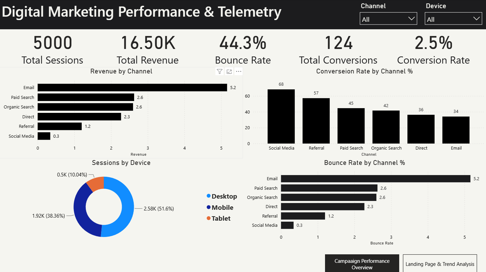
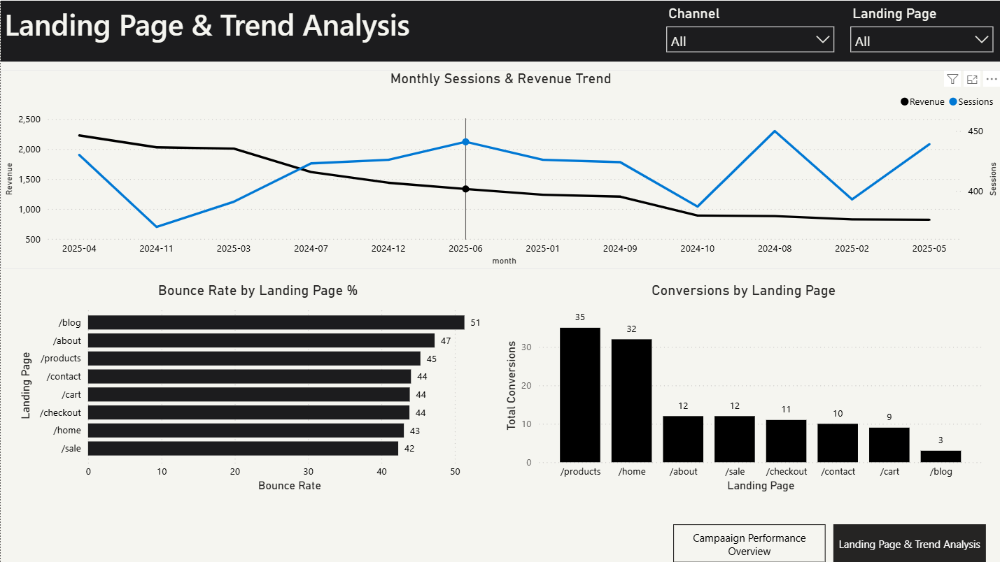

# Web Analytics & Telemetry Dashboard 📈

**Tools:** Python | Power BI | DAX  
**Industry:** Digital Marketing / E-Commerce Analytics

## Overview
Simulated a 12-month web analytics dataset of 5,000 sessions across 6 
acquisition channels, 3 devices, and 8 landing pages. Built a Python data 
pipeline generating realistic behavioral telemetry — including bounce events, 
conversion flags, session duration, and revenue — then delivered a 2-page 
Power BI dashboard translating raw session data into channel performance 
insights, landing page optimization opportunities, and monthly trend analysis.

## Dashboard Preview

## Key Findings
- **Email converts best** at 5.16% — nearly double Organic Search (2.60%) 
  and 15x Social Media (0.34%)
- **Social Media has negative ROI** — 583 sessions, 68% bounce rate, 
  only $103 revenue
- **Mobile underperforms Desktop** — 38% of sessions but lower conversion 
  rate despite similar volume
- **Blog content isn't converting** — 51.3% bounce rate, only 3 conversions 
  from 152 sessions
- **Organic Search drives the most revenue** ($6,186) but at only 2.6% 
  conversion — room to improve

## Dashboard Pages

### Page 1 — Campaign Performance Overview
- 5 KPI cards: Total Sessions, Total Revenue, Conversion Rate, Bounce Rate, Total Conversions
- Revenue by Channel bar chart
- Conversion Rate by Channel bar chart
- Bounce Rate by Channel bar chart (red — negative metric)
- Sessions by Device donut chart
- Channel and Device slicers

### Page 2 — Landing Page & Trend Analysis
- Monthly Sessions & Revenue trend line chart
- Bounce Rate by Landing Page bar chart
- Conversions by Landing Page bar chart
- Month and Landing Page slicers

## Data Pipeline
Built entirely in Python using pandas and NumPy:

| File | Description |
|---|---|
| web_sessions.csv | 5,000 sessions with channel, device, landing page, bounce, conversion, revenue |
| web_monthly_trend.csv | Monthly aggregated sessions, conversions, revenue, bounce rate |

## DAX Measures
- `Total Sessions` — COUNTROWS of web_sessions
- `Total Revenue` — SUM of revenue column
- `Total Conversions` — FILTER count where converted = TRUE
- `Overall Conversion Rate` — formatted as % with 1 decimal
- `Overall Bounce Rate` — formatted as % with 1 decimal
- `Channel Conversion Rate` — dynamic conversion rate responding to slicers
- `Channel Bounce Rate` — dynamic bounce rate responding to slicers
- `Monthly Sessions` — COUNTROWS for trend chart
- `Monthly Revenue` — SUM for trend chart

## Key Marketing KPIs Covered
- **CVR** (Conversion Rate) — sessions that resulted in a purchase
- **Bounce Rate** — sessions where user left without interacting
- **Revenue per Session** — average revenue generated per visit
- **Channel ROI** — revenue relative to session volume by acquisition source

## Skills Demonstrated
Python · pandas · NumPy · Power BI · DAX · Digital Marketing Analytics ·
Telemetry Analysis · Campaign Reporting · Executive Dashboards · KPI Design

## Live Portfolio
[View Portfolio](https://nikolaszeiner.github.io/NikolasZeiner/)
